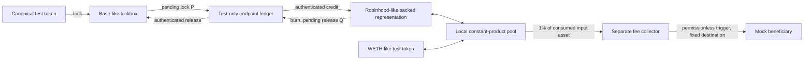
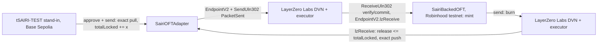

# Architecture: local vertical slice and gated production direction

**EXPERIMENTAL — UNAUDITED — NO MAINNET DEPLOYMENT**

## Implemented local topology

Both logical domains execute inside one credential-free Foundry EVM. The test-only endpoint transports messages; it does not implement cryptographic cross-chain verification.

There is no edge granting the fee collector access to lockbox backing, representation minting or LP withdrawals. Canonical minting is a test-only mock function. Representation minting requires the immutable endpoint and peer path. Replay-protected messages remain retryable after a failed credit/release.

The lockbox/representation owners can pause and change exposure/outbound rate limits; they cannot directly mint or withdraw collateral, but can indefinitely stall redemption. Authenticated verifier compromise can still forge credits or drain backing; explicit negative tests demonstrate this residual trust.

The pool is an original **constant-product integration harness**, not Uniswap v4 or a concentrated-liquidity approximation. Creator fees are 100 bps of consumed gross input; LP fees are separately charged on the remainder. LP additions consume proportional inputs and enforce minimum shares; removals enforce both output minima. Exact-output swaps and engine-driven partial fills are unsupported. A user may consume less than an explicit maximum, with the remainder never transferred.

## Accounting boundary

All liabilities are normalized to shared-decimal integer units: R includes the entire representation totalSupply, including the pool, treasury, vesting and unclaimed rewards. P is finalized locks not yet credited; Q is finalized burns not yet released.

The safety observation is **L = actual observed canonical backing held**, normalized conservatively, and L >= R + P + Q. `totalLocked` is a contract accounting record, not a substitute for an observed token balance. The Solidity fixtures prove the stricter tracked-liability equality and separately assert actual balance covers that record. Donations/dust/surplus must be explained separately. Two independent latest-block reads do not form a coherent finalized snapshot.

## Offline tooling boundary

Typed configuration validation, integer pool simulation, and snapshot evaluation are offline tools. Unknown live addresses remain null. Documentary candidates are isolated in `config/research/`; they are never silently promoted to deployment parameters. A common epoch label alone is not cryptographic proof that two finalized chain observations are comparable. No persistent monitor, claim scheduler, transaction signer or public-chain deployment tool is installed.

## LayerZero OFT topology (testnet-only implementation)

The same canonical-lockbox / backed-representation architecture, built on the official LayerZero OFT contracts:

- `SairiOFTAdapter` extends `OFTAdapter`; `SairiBackedOFT` extends `OFT`; both mix in `SairiOFTGuards` (one remote EID, once-only peer, pause, outbound rate limit, exposure cap, dust/compose/recipient checks). Neither has a mint or withdraw entry point beyond LayerZero delivery.
- Messages use the standard OFT v1 encoding (recipient bytes32, amount in 6 shared decimals). Shared-decimal dust is rejected rather than left with the sender.
- The wiring script pins send/receive libraries, the LayerZero Labs DVN, confirmations and executor per OApp, so default changes by LayerZero do not silently change the route. The script's `send()` re-checks the effective per-app route and exact enforced options before broadcasting.
- Cross-chain observation tooling reports raw, unsynchronized values with backing status `UNKNOWN`; in-flight liabilities are never inferred from balances.
- Owner = endpoint delegate = the testnet operator. The delegate can still change libraries/DVNs at the endpoint; this is the main residual trust (see THREAT_MODEL).
- Local tests run genuine EndpointV2/ULN302 code for both chains in one EVM with test DVN/executor workers; the opt-in fork test runs the real scripts against the live testnet LayerZero deployments with an impersonated DVN.

## Production direction, not an implemented integration

Conditional candidate: a single canonical Base OFTAdapter plus backed Robinhood OFT representation. Existing adapters and mint domains must be checked before proposing a new lockbox. CCIP remains an availability-dependent alternative. See [ADR 0001](adr/0001-interoperability.md), [sources](SOURCES.md) and the integration backlog. Actual canonical identity, beneficiary, endpoint/library/DVN configuration, bytecode, DEX integration, license compatibility and audits remain production gates.
